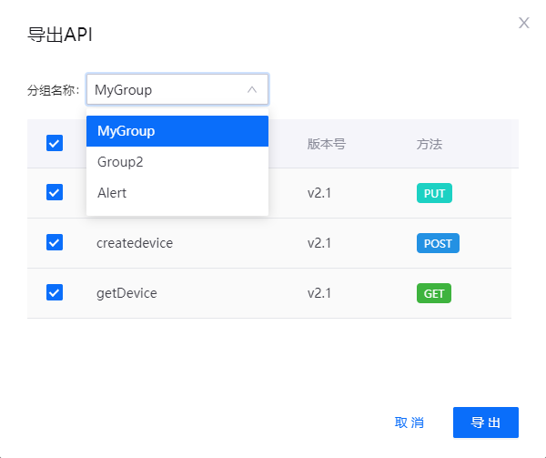

# 导出API

为方便用户将已构建的API迁移到其他EnOS环境、定期备份API，API管理提供了导出API配置的功能。用户可将所有或部分已构建的API导出成JSON文件，继而再导入EnOS。有关如何导入API，参考[导入API](importing_api)。

## 任务描述

本文介绍了如何在API管理中导出已构建的API配置信息。

## 开始前准备

- 拥有一个EnOS账号，并拥有定义API操作需要的相应权限，参考[策略，角色，与权限](/docs/iam/zh_CN/latest/access_policy)。
- 已经完成了[构建API](creating_api)。

## 步骤

1. 选择 **API管理 > 我的API**，点击**导出API**。

2. 选择需要导出的API所在的分组，勾选需要导出的API，点击**导出**。
   
   

## 结果

所选分组内的API配置信息被记录在JSON文件内。

## 后续操作

[导入API](importing_api)