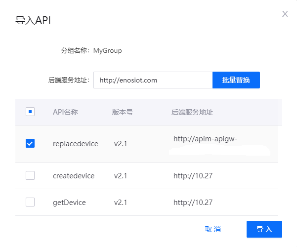

# 导入API

用户可以将已导出的API配置文件（JSON）导入EnOS，以实现批量构建API。有关如何导出API，参考[导出API](exporting_api)。

## 任务描述

本文介绍了如何在API管理中通过JSON文件批量构建API。

## 开始前准备

- 拥有一个EnOS账号，并拥有定义API操作需要的相应权限，参考[策略，角色，与权限](/docs/iam/zh_CN/latest/access_policy)。
- 已有符合规范的JSON文件。参考[导出API](exporting_api)。

## 步骤

1. 选择 **API管理 > 我的API**，点击**导入API**。

2. 选择从EnOS上导出的JSON文件。

3. 勾选需要导入的API。你也可以为所选的API批量更新后端服务地址。完成后点击**导入**。

   

## 结果

在**我的API**页面，可以看到导入成功的API分组。点击进入分组，可以看到所有导入的API。当前API的状态为**下线**，是否公开为**私有**。

## 后续操作

[部署API](deploying_api)