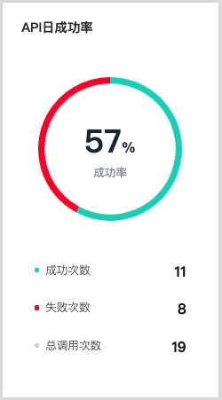
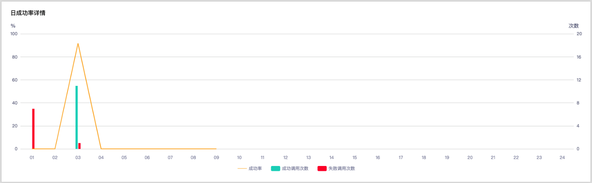
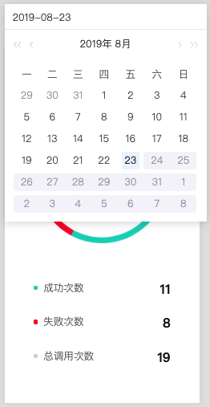

# 监控API

对于已经上线并公开的API，用户可以在**API监控**查看其基本信息及被调用的情况。

## 开始前准备
- 拥有一个EnOS账号，并拥有定义API操作需要的相应权限，参考[策略，角色，与权限](/docs/iam/zh_CN/latest/access_policy)。
- 已经完成了[构建API](creating_api)及[部署API](deploying_api)。

## API健康监控

点击API条目后的**健康度**按钮可以查看该API在当日（24小时）内被调用的次数及调用成功率。

### 查看API日调用成功率

在**API健康监控**页面左侧可查看该API的日调用成功率、调用成功次数、调用失败次数及总调用次数。

### 查看API日调用成功率详情

在**API健康监控**页面的**日成功率详情**图表展示了该API在当日每个时段（小时）调用成功次数、调用失败次数及调用成功率。

### 查看历史调用数据

在日期的下拉列表选择需要查看的日期即可查看当日该API被调用的状况。

<!--end-->