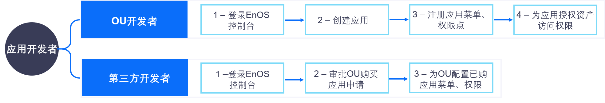

应用开发者
=================
应用开发者可以是企业或组织内部的应用开发人员，也可以是第三方应用开发者。应用开发者需对应用做相应的配置，应用才能同步和展示到Application Portal。

应用开发者在EnOS控制台管理应用的任务和工作流程如下图所示：

.. toctree::
   :maxdepth: 1
   :caption: 操作

   developing_apps
