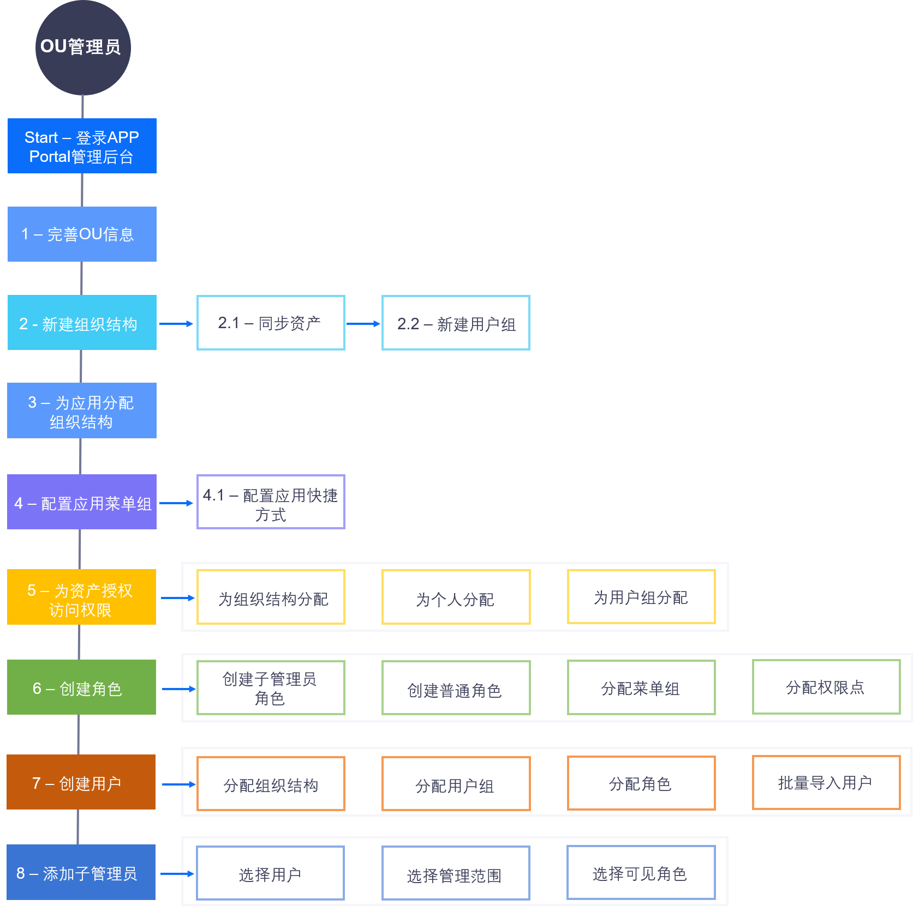

OU管理员
=================
OU管理员通过系统管理员分配的账号，登录Application Portal，进入管理后台，负责企业或组织内应用的分类管理、用户与权限、和资产等的全面管理。

OU管理员在Application Portal管理后台任务和工作流程如下图所示：

.. toctree::
   :maxdepth: 1
   :caption: 操作

   console_intro
   managing_ou
   managing_apps
   creating_app_shortcut
   managing_roles
   managing_users
   managing_user_groups
   managing_asset_permission
   managing_sub_admin
   ou_settings
