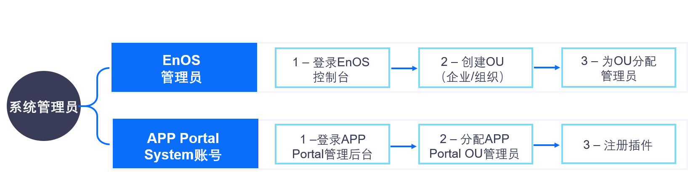

系统管理员
==================
EnOS系统管理员在EnOS控制台完成OU的创建和初始化，登录Application Portal为企业或组织分配OU管理员。

系统管理员的任务和工作流程如下图所示：

.. toctree::
   :maxdepth: 1
   :caption: 操作

   assigning_ou_admin
   integrating_plugins
