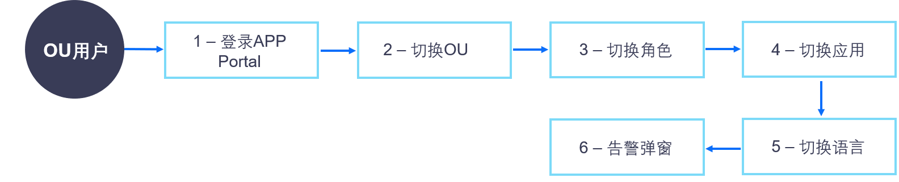

普通用户
=================
普通用户，即应用的实际使用者。用户通过OU管理员创建的账号登录Application Portal，使用企业或组织内开发或购买的应用，查看或管理有权限访问的资产，进行经授权的相关的操作。

用户登录Application Portal使用应用的操作如下图所示：

.. toctree::
   :maxdepth: 1
   :caption: 操作

   portal_intro
   managing_messages
