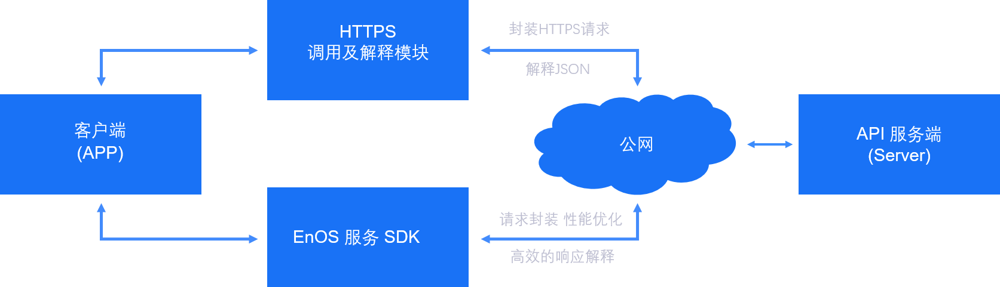

# EnOS API 简介

EnOS系统向合作伙伴开放涵盖系统各个核心业务流程的REST API接口。基于这些接口，开发者可以向自己的用户提供各类应用，支持智能设备接入、数据获取、数据存储、数据挖掘、数据可视化等业务场景。

## API 服务分类

EnOS系统为开发者提供如下接口服务：

- **设备连接服务**：全面开放EnOS系统在设备连接和设备管理领域的业务能力，包括设备的注册、连接、更新、删除等。
- **物模型服务**：开发组织内对产品的功能和特性的定义。
- **资产管理服务**：开放组织内资产的创建、管理、更新等服务。
- **数据服务**：开放设备数据收集服务。
- **文件服务**：提供文件管理服务，包括文件上传，下载，保存和删除。

## 调用EnOS API的方式

EnOS REST API是基于HTTP协议来调用的。开发者可以直接使用系统提供的官方SDK（支持Java语言，包含了请求的封装，签名加密，响应解释，性能优化等）来调用，也可以根据约定的协议来封装HTTP请求进行调用。

- **使用EnOS Service SDK**: EnOS系统提供的官方SDK支持java语言，包含了请求的封装，签名加密，响应解释，性能优化等功能，只需很少的编程工作，就可方便地调用EnOS REST API。使用EnOS Service SDK的详细步骤，请参考[EnOS SDK 快速入门](gettingstarted_sdk)。
- **手动封装HTTP请求**: 如果不使用EnOS Service SDK，也可以根据约定的协议来封装HTTP请求调用API，请参考[调用 EnOS REST API](call_enos_api)。

 以下是大致的API调用过程示意图：

## 参考

- [EnOS REST API 快速入门](gettingstarted_api)
- [EnOS SDK 快速入门](gettingstarted_sdk)
